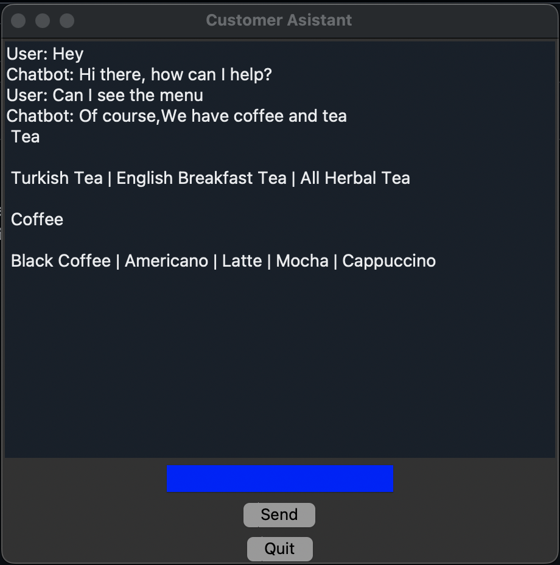
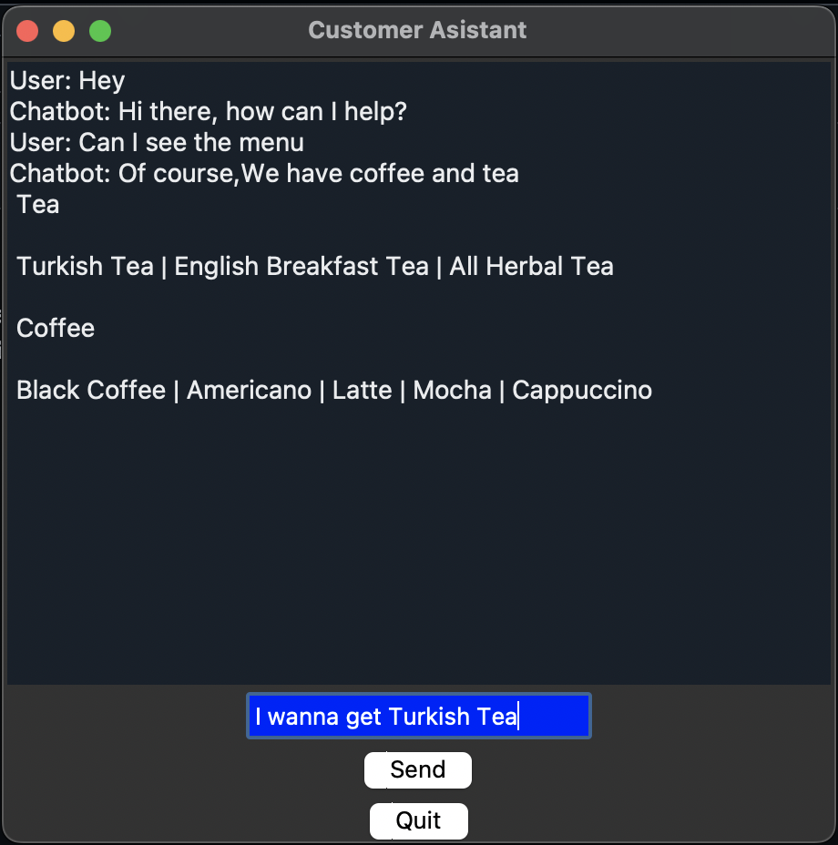
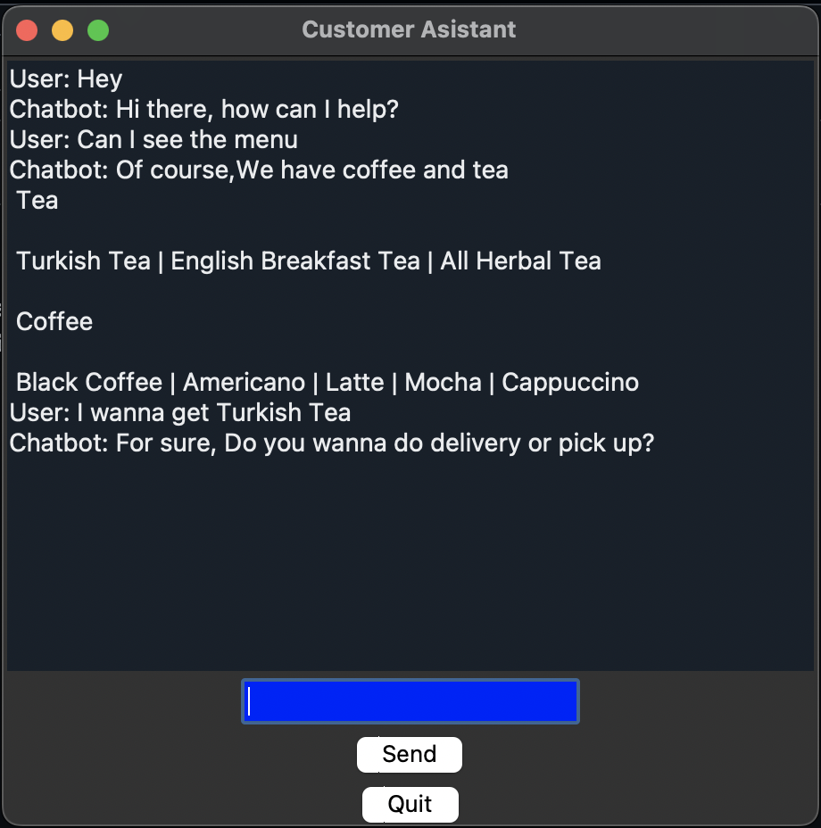
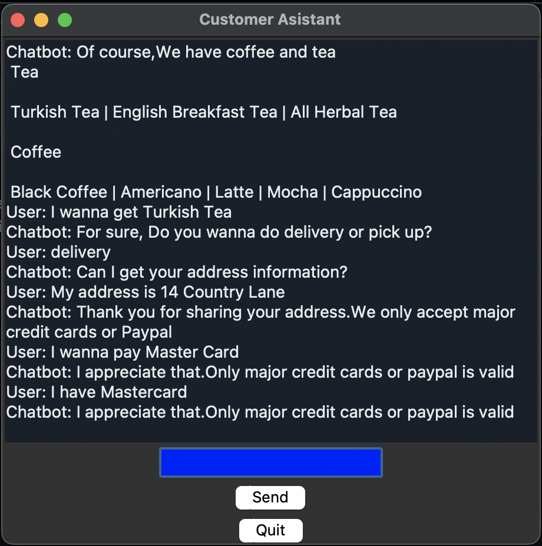
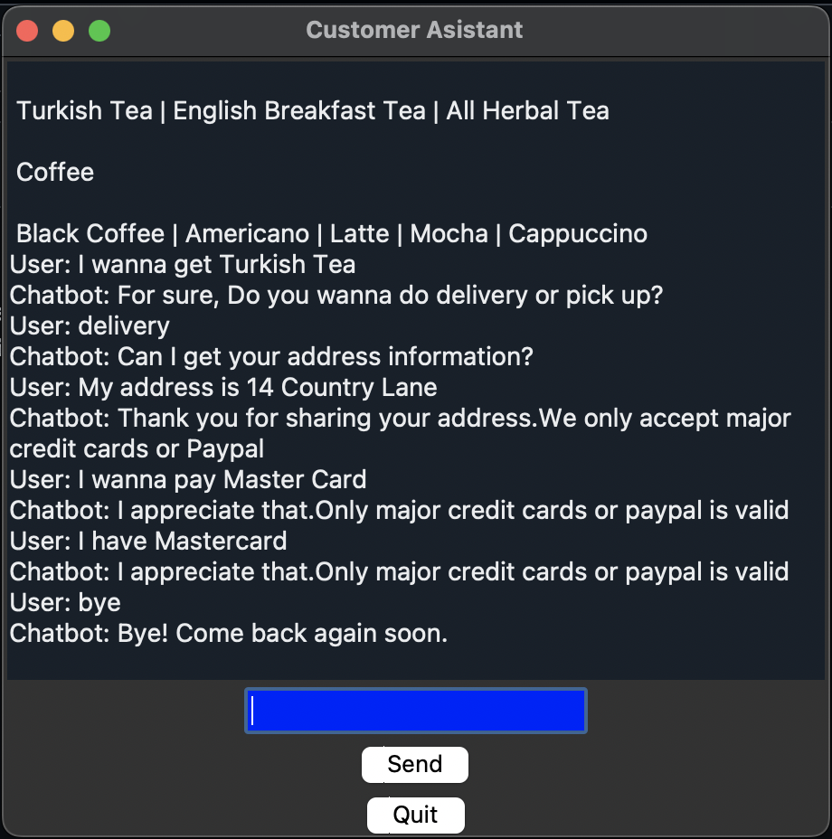

# BasicNLPChatBot

# This is a basic Coffee Shop chatbot . For chatbot training , we have intents.json file .Intents file has tags , patterns and responses.Patterns have been converted to vector using Bag of Words algorithm and then trained with pattern vector . Basic GUI is made in this project using tkinter library 

## Program Output

